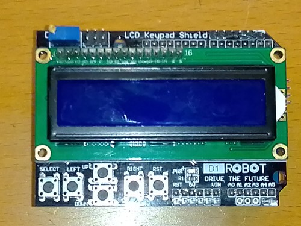

# LCD_Keypad_Shield

## Pinbelegung
### Reihe oben rechts

13 - 12 - 11 - 3 - 2 - 1 - 0

## Reihen unten neben Taster

RST - 3,3V - 5V - GND - GND - VIN -- (A0) - A1 - A2 - A3 - A4 - A5

## Taster
Die Taster sind an A0 angeschlossen.