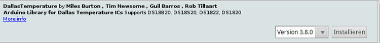

# DS18B20

-----

**Status**: [ ]Planung [ ] In Arbeit [x] Läuft [ ] Dokumentiert [ ] Veröffentlicht

**Boards**: [x] Uno [ ] Nano [ ] NodeMCU 8266 [ ] NodeMCU 32 [ ] ATiny x5

-----

## Baustein
Temperaturfühler von Dallas. 1Wire. 

## Library

    name=DallasTemperature
    version=3.8.0
    author=Miles Burton <miles@mnetcs.com>, Tim Newsome <nuisance@casualhacker.net>, Guil Barros <gfbarros@bappos.com>, Rob Tillaart <rob.tillaart@gmail.com>
    maintainer=Miles Burton <miles@mnetcs.com>
    sentence=Arduino Library for Dallas Temperature ICs
    paragraph=Supports DS18B20, DS18S20, DS1822, DS1820
    category=Sensors
    url=https://github.com/milesburton/Arduino-Temperature-Control-Library
    architectures=*

## Beispiel-Sketch
    // DS18B20
    #include <OneWire.h>
    #include <DallasTemperature.h>
    #define ONE_WIRE_BUS 12
    OneWire oneWire(ONE_WIRE_BUS);
    DallasTemperature sensors(&oneWire);
    
    // LCD.Keypad Shield
    #include <LiquidCrystal.h>
    const int rs = 8, en = 9, d4 = 4, d5 = 5, d6 = 6, d7 = 7;
    LiquidCrystal lcd(rs, en, d4, d5, d6, d7);
    
    
    void setup(void)
    {
      // DS18B20
      sensors.begin();
    
      // LCD Keypad Shield
      lcd.begin(16, 2);
      lcd.setCursor(0, 0);
      lcd.print("DS18B20:");
      lcd.setCursor(14, 0);
      lcd.print("\337C");
      lcd.setCursor(0, 1);
      // äöüß µΩαεΣπρp∞
      lcd.print("\341\357\365\342 \344\364\340\343\366\367\346p\363");
    }
    
    void loop(void)
    { 
      sensors.requestTemperatures();
      lcd.setCursor(9, 0);
      lcd.print(sensors.getTempCByIndex(0));
    
    }

## Alle Funktionen der Library